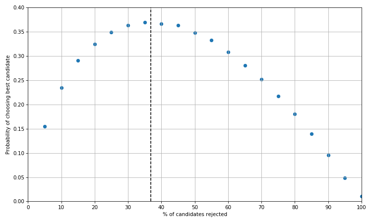
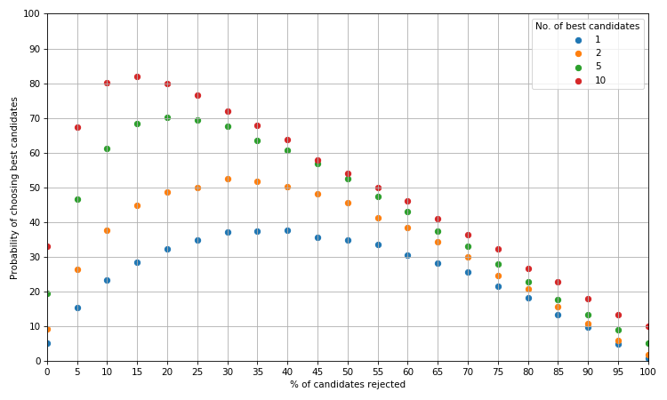

# Solving the secretary problem with Python

The secretary problem is a hypothetical question regarding how best to choose a candidate for a job position.  The formulation and mathematical solution is outlined quite clearly [here](https://en.wikipedia.org/wiki/Secretary_problem).  This post explores how to solve the problem numerically in Python.

In short, a known number of candidates are interviewed one at a time in a random order to fill one position.  The interviewer knows nothing about the abilities of the candidates to come but can rank those that have been seen from best to worst.  After each interview, the candidate is either rejected or accepted and this decision is final.  The solution to this problem will maximise the probability of selecting the best candidate.   

We start by forming a list of candidates ordered from 1 to n where 1 is the best candidate.  

```python
from __future__ import division
import numpy as np
candidates = np.arange(1, n+1)
# simulate random order of candidates being interviewed
np.random.shuffle(candidates)
```

The optimal solution is to reject the first `n/e` applicants (e ~ [2.718](https://en.wikipedia.org/wiki/E_(mathematical_constant))) and choose the first candidate who is better than the best candidate from the `n/e` rejected candidates.  If there is no candidate who is better then choose the last candidate.

For our n candidates we reject the first `int(round(n/np.e))` candidates.  The best candidate from this list will be the minimum value (since lower is better).

```python
stop = int(round(n/np.e)) 
best_from_rejected = np.min(candidates[:stop])
rest = candidates[stop:]
# Index zero since we choose the first candidate who is better
chosen_candidate = rest[rest < best_from_rejected][0]
```

The last line will return an error if there is no candidate in `rest` who is better than `best_from_rejected`.  Hence we catch this error and return the last candidate.

```python
stop = int(round(n/np.e)) 
best_from_rejected = np.min(candidates[:stop])
rest = candidates[stop:]
try:
	return rest[rest < best_from_rejected][0]
except IndexError:
	return candidates[-1]
```

We can wrap all of this in a function.
```python
def choose_candidate(n):
	'''Choose a candidate from a list of n candidates using 
	the optimal strategy.'''

    candidates = np.arange(1, n+1)
    np.random.shuffle(candidates)
    
    stop = int(round(n/np.e)) 
    best_from_rejected = np.min(candidates[:stop])
    rest = candidates[stop:]
    
    try:
    	return rest[rest < best_from_rejected][0]
    except IndexError:
    	return candidates[-1]
```

Now let's see if this function is a good solution by simulating its output.  

```python
# choose from 100 candidates and run simulation 100,000 times
sim = np.array([choose_candidate(n=100) for i in range(100000)])

plt.figure(figsize=(10, 6))
plt.hist(sim, bins=100)
plt.xticks(np.arange(0, 101, 10))
plt.ylim(0, 40000)
plt.xlabel('Chosen candidate')
plt.ylabel('frequency')
plt.show()
```


We can see that candidate no. 1 is chosen most often.  In fact the distribution is heavily skewed towards the best few candidates, so even if you don't get the very best there is a high chance you will select one of the top 10% of candidates.  This is further illustrated by the plotting the cumulative density function of this distribution.

```python
plt.figure(figsize=(10, 6))
plt.plot(np.cumsum(np.histogram(sim, bins=100)[0])/100000)
plt.ylim(0,1)
plt.xlim(0, 100)
plt.yticks(np.arange(0, 1.1, 0.1))
plt.xticks(np.arange(0, 101, 10))
plt.xlabel('Chosen candidate')
plt.ylabel('Cumulative probability')
plt.show()
```


Interestingly, the probability of choosing one of the best candidates rises very quickly up to about the 10th candidate before increasing in a linear fashion.

Let's now see if we are likely to choose the best candidate with a different strategy.  Instead of rejecting the first 36.8% (1/e) of candidates, we can reject the first 10%, 20%, 40%, 50% etc. of candidates.

By adjusting our `choose_candidate` function we can add an argument to specify the proportion of candidates we initially reject.  

```python
def choose_candidate(n, reject=np.e):
	'''Choose a candidate from a list of n candidates using 
	a specified strategy.

	reject: percentage of candidates to initially reject (optimal strategy by default)
	'''

    candidates = np.arange(1, n+1)
    np.random.shuffle(candidates)
    
    if reject == np.e:
        stop = int(round(n/reject))
    else:
        stop = int(round(reject*n/100))

    best_from_rejected = np.min(candidates[:stop])
    rest = candidates[stop:]
    
    try:
    	return rest[rest < best_from_rejected][0]
    except IndexError:
    	return candidates[-1]
```

Let's now plot the probability of choosing the best candidate (i.e. candidate no. 1) by the percentage of candidates rejected.

```python
best_candidate = []
for r in range(5, 101, 5):
    sim = np.array([choose_candidate(n=100, reject=r) for i in range(100000)])
    # np.histogram counts frequency of each candidate
    best_candidate.append(np.histogram(sim, bins=100)[0][0]/100000)

plt.figure(figsize=(10, 6))
plt.scatter(range(5, 101, 5), best_candidate)
plt.xlim(0, 100)
plt.xticks(np.arange(0, 101, 10))
plt.ylim(0, 0.4)
plt.xlabel('% of candidates rejected')
plt.ylabel('Probability of choosing best candidate')
plt.grid(True)
plt.axvline(100/np.e, ls='--', c='black')
plt.show()
```



As we would expect the optimal strategy is somewhere in between 35% and 40% i.e. 1/e.  The probability of choosing the best candidate when we reject the first n/e candidates also happens to be 1/e.  

Finally, we as hiring managers may be content with selecting one of the best rather than the very best candidate.  

```python
def get_best_candidates(best_n=1):
    '''Return a list of probabilities for different rejection strategies and specify what percentage of the
    best candidates we want to select.'''
    
    best_candidate = []
    for c in [1] + range(5, 101, 5):
        sim = np.array([choose_candidate(100, reject=c) for i in range(10000)])
        best_candidate.append(len(sim[sim <= best_n])/100)
        
    return best_candidate
```

Let's see what our optimal rejection strategy should be given we want the best 1, 2, 5, or 10 candidates out of 100.

```python
plt.figure(figsize=(10, 6))
for i in [1, 2, 5, 10]:
    plt.scatter(range(0, 101, 5), get_best_candidates(i), label=str(i))
plt.xlim(0, 100)
plt.ylim(0, 100)
plt.xticks(np.arange(0, 101, 5))
plt.yticks(np.arange(0, 101, 10))
plt.xlabel('% of candidates rejected')
plt.ylabel('Probability of choosing best candidates')
plt.legend(title='No. of best candidates')
plt.grid(True)
plt.tight_layout()
plt.show()
```



The blue curve is as before i.e. when we want the one best candidate.  If we wanted one of the best 2 candidates, the optimal strategy is to reject the first 30% of candidates which will give us a greater than evens chance of getting what we want.  For the best 5 and 10 candidates we can increase that probaility to 70% and over 80% respectively by using the optimal strategy.  

This post has demonstrated a simple exploration of the secretary problem implemented in Python as well as briefly probing at how the problem can be extended.

---
[Home](../index.md)
