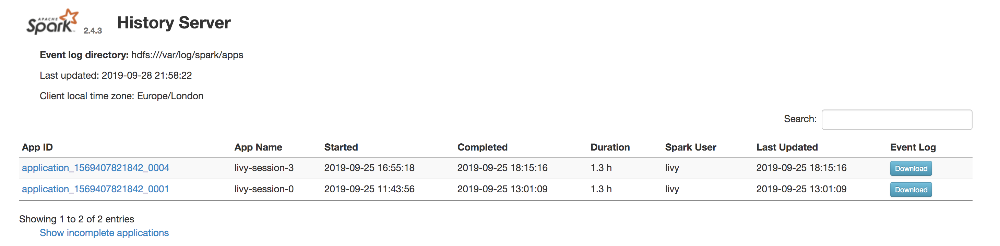

## Running the Spark UI locally

You would commonly run Spark on a remote cluster like AWS EMR.  We can monitor applications using the [Spark UI](https://spark.apache.org/docs/latest/monitoring.html), however this information will be lost after the cluster is shut down.  To continue to examine a Spark application, we will need to run the Spark UI locally.

We first need to download the event logs from the History Server when the cluster is still running.  This is obtained from `http://<driver-node-ip>:18080`, then by clicking Download on the appropriate application.



Unzip and store these in a separate directory e.g. `/Users/imran/Desktop/spark-events/`.

To run the UI locally, we need to navigate to the Spark source code directory and set the path to `$SPARK_HOME` (it can be downloaded from [here](https://spark.apache.org/downloads.html)).  For me this variable is `/Users/imran/software/spark-2.4.3-bin-hadoop2.7`.

Create a new file in `$SPARK_HOME/conf` called `spark-defaults.conf` and add the following line with the directory you created above:
```text
spark.history.fs.logDirectory file:/Users/imran/Desktop/spark-events
```

Run `$SPARK_HOME/sbin/start-history-server.sh` to start the Spark UI.

Now go to `http://localhost:18080` in a browser and you should see the History Server with the application you downloaded.

Run `$SPARK_HOME/sbin/stop-history-server.sh` to stop the UI.

---
[Home](../index.md)
